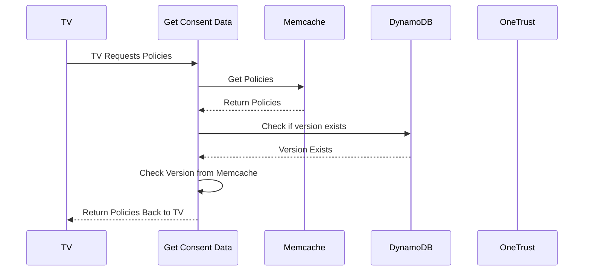
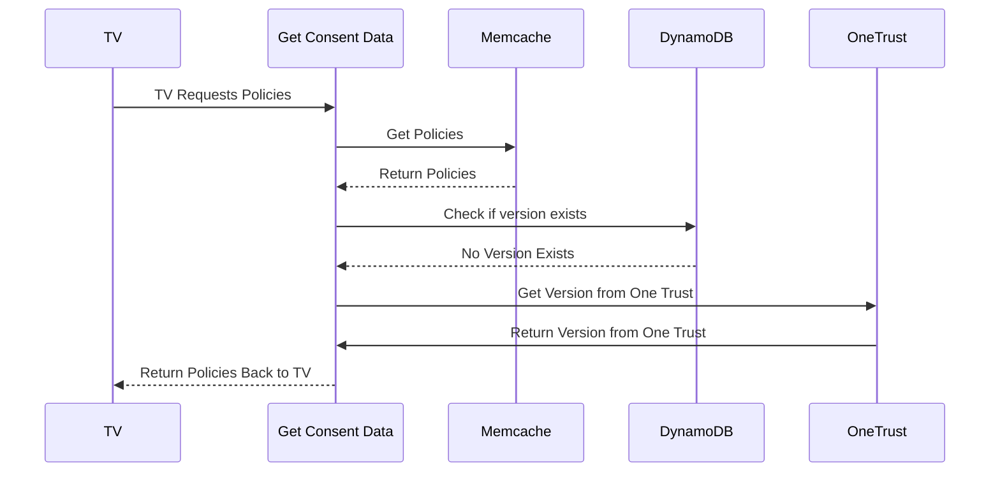
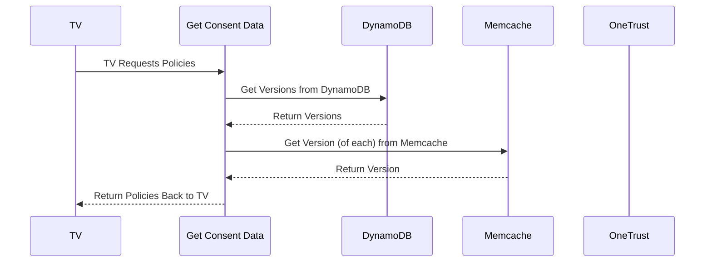

# CMS - Get Consent Data

## Scenarios

### (Current) Version Does Exist in DynamoDB

```mermaid
sequenceDiagram
participant T as TV
participant A as Get Consent Data
participant B as Memcache
participant C as DynamoDB
participant D as OneTrust
T->>A:TV Requests Policies
A->>B:Get Policies
B-->>A:Return Policies
A->>C:Check if version exists
C-->>A:Version Exists
A->>A:Check Version from Memcache
A-->>T:Return Policies Back to TV
```

### (Current) No Version Exists in DynamoDB

```mermaid
sequenceDiagram
participant T as TV
participant A as Get Consent Data
participant B as Memcache
participant C as DynamoDB
participant D as OneTrust
T->>A:TV Requests Policies
A->>B:Get Policies
B-->>A:Return Policies
A->>C:Check if version exists
C-->>A:No Version Exists
A->>D:Get Version from One Trust
D->>A:Return Version from One Trust
A-->>T:Return Policies Back to TV
```

### (Future) Version Does Exist in DynamoDB

```mermaid
sequenceDiagram
participant T as TV
participant A as Get Consent Data
participant B as DynamoDB
participant C as Memcache
participant D as OneTrust
T->>A:TV Requests Policies
A->>B:Get Versions from DynamoDB
B-->>A:Return Versions
A->>C:Get Version (of each) from Memcache
C-->>A:Return Version
A-->>T:Return Policies Back to TV
```